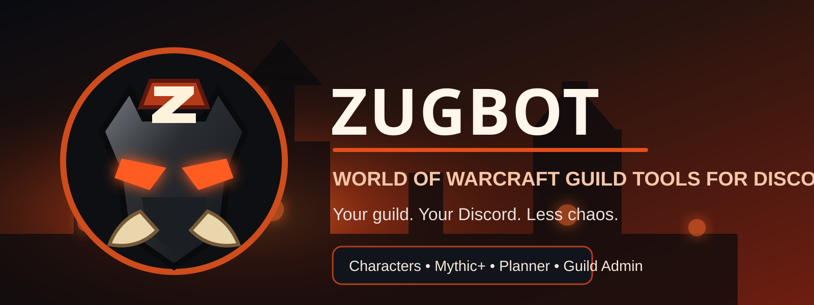

<h1 class="zug-visually-hidden">ZugBot</h1>

  
<strong>A World of Warcraft guild companion and management bot built for Discord.</strong> ZugBot brings character profiles, Mythic+ group tools, Smart LFG notifications, onboarding, and guild administration into the place your guild already uses.

  

    <a class="md-button md-button--primary" href="getting-started/">Get started</a>
    <a class="md-button" href="commands/">View commands</a>
  

## What ZugBot does today

  

    <h3>👤 Characters & Warbands</h3>
    
Link your characters, choose a main, manage alts, and view character profiles from Discord.

  

  

    <h3>⚔️ Mythic+</h3>
    
Create interactive Modern WoW Mythic+ groups with Tank, Healer, DPS, PUG slots, owner controls, and restart-safe persistence.

  

  

    <h3>🔔 Smart LFG</h3>
    
Opt in by role and key range so group leaders can notify interested players without pinging the entire server.

  

  

    <h3>📅 Guild Planner</h3>
    
Create Discord Scheduled Events with persistent event cards, RSVP buttons, editing, cancellation, and guild-local timezone handling.

  

  

    <h3>🛡️ Guild Administration</h3>
    
Configure channels, game preferences, guild roles, member progression, and a Rules & Vibes onboarding agreement.

  

## Built for guilds, not spam

ZugBot is designed around a few simple ideas:

- keep setup manageable;
- keep features guild-scoped;
- let players opt in to notifications;
- preserve member choice;
- make routine guild organization easier inside Discord.

!!! info "Current release"
    The production bot currently reports version **0.4.0**. Features under active development are listed on the [Roadmap](roadmap.md) and are clearly separated from released functionality.

## Support ZugBot

ZugBot is independently developed and hosted. Support helps cover the domain, hosting, infrastructure, development tools, and continued development. Core ZugBot functionality is not locked behind payment.

  <a class="md-button md-button--primary" href="https://buymeacoffee.com/ZugBot" target="_blank" rel="noopener">☕ One-time support</a>
  <a class="md-button" href="https://patreon.com/ZugBot" target="_blank" rel="noopener">🔥 Monthly support</a>

Enjoying ZugBot? Toss a few gold into the repair fund. 🔥

## Where to go next

- New to ZugBot? Start with [Getting Started](getting-started.md).
- Already in a server with ZugBot? Read the [Member Guide](member-guide.md).
- Running the server? See [Guild Administration](admin-guide.md).
- Need one command quickly? Open the [Command Reference](commands.md).

