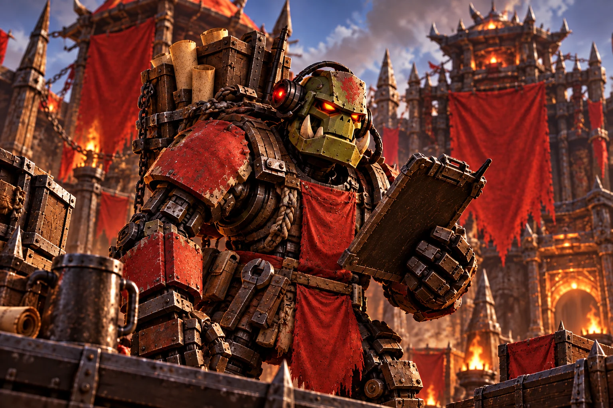
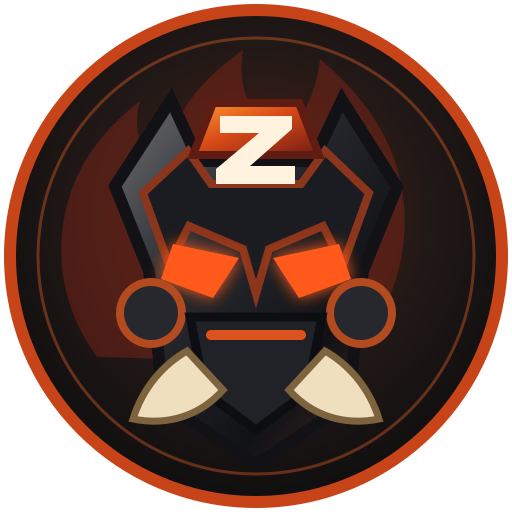

<section class="zb-hero" aria-labelledby="hero-title">
  
  

    

      
World of Warcraft · Discord

      <h1 id="hero-title">Less admin. More Warcraft.</h1>
      
Your guild's extra pair of hands.

      
Raid night. Key groups. A whole warband of alts. ZugBot handles the busywork so your guild can get back to playing.

      

        <a class="zb-button zb-button-primary" href="getting-started/">Get started with ZugBot</a>
        <a class="zb-button" href="#features">Explore features</a>
      

      
Built for guilds. Runs inside Discord.

    

  

</section>

<nav class="zb-capabilities" aria-label="Feature guides">
  

    <a href="planner/">Guild Planner</a>
    <a href="member-guide/">Characters &amp; Warbands</a>
    <a href="member-guide/">Mythic+ Groups</a>
    <a href="member-guide/">Smart LFG</a>
    <a href="admin-guide/">Guild Administration</a>
  

</nav>

<section class="zb-section zb-planner" id="features" aria-labelledby="planner-title">
  

    

      
01 / Get the guild together

      <h2 id="planner-title">A raid night. A plan. <em>Everyone in the loop.</em></h2>
      
Create your event, let members choose their roles, and see your roster take shape. ZugBot keeps the Planner card and Discord Scheduled Event together.

      <ul class="zb-detail-list">
        <li>Tank, Healer, DPS, and Bench signups</li>
        <li>Event times in each member's local timezone</li>
        <li>Persistent cards that work after a bot restart</li>
      </ul>
      <a class="zb-text-link" href="planner/">Explore Guild Planner</a>
    

    <figure class="zb-planner-preview">
      <figcaption>Example Planner card</figcaption>
      
# raid-and-events

      

        
        <strong>ZugBot</strong>APP
      

      

        
Guild Planner · Raid

        <h3>Friday Raid Night</h3>
        
Bring your flasks. We've got bosses to pull.

        

Starts<strong>Friday · 8:00 PM</strong>

Composition<strong>2 Tank · 4 Healer · 11 DPS</strong>

        

<strong>Tanks</strong>@GuildMember · @GuildMember

<strong>Healers</strong>@GuildMember · +3 more

<strong>DPS</strong>@GuildMember · +10 more

      

      
TankHealerDPSBenchMaybeCan't Attend

      
Illustrative example. Actual events run in your Discord server.

    </figure>
  

</section>

<section class="zb-section zb-tools" aria-labelledby="tools-title">
  

    

The rest of the guild comes with it
<h2 id="tools-title">One bot. A lot less busywork.</h2>

    

      <article class="zb-tool">02
<h3>Characters &amp; Warbands</h3>
Your main, your alts, your identity. Link your characters once and keep them together across ZugBot's member workflows.
<a class="zb-text-link" href="member-guide/">Meet your warband</a>
</article>
      <article class="zb-tool">03
<h3>Mythic+ Groups</h3>
Build a group with role slots, linked characters, and PUG controls. Keep organizing the next key right where your guild already talks.
<a class="zb-text-link" href="commands/">See group commands</a>
</article>
      <article class="zb-tool">04
<h3>Smart LFG</h3>
Reach members interested in the roles and key ranges you're running. Members choose their notifications, so every group doesn't need an everyone ping.
<a class="zb-text-link" href="member-guide/">Find your next group</a>
</article>
      <article class="zb-tool">05
<h3>Guild Administration</h3>
Set up your channels, map your guild's authority roles, and welcome newcomers with a persistent rules agreement. Your server, your structure.
<a class="zb-text-link" href="admin-guide/">Open the admin guide</a>
</article>
    

  

</section>

<section class="zb-section zb-start" aria-labelledby="start-title">
  

    

Put ZugBot to work
<h2 id="start-title">Your guild has enough bosses to deal with.</h2>
Start with setup. Link your characters. Plan the next run.

<a class="zb-button zb-button-primary" href="getting-started/">Read the setup guide</a><a class="zb-button" href="commands/">Browse commands</a>

    

<strong>Discord is the interface.</strong>Buttons, selectors, and event cards. No extra dashboard for members to check.

<strong>Your guild stays your guild.</strong>Server-specific configuration, authority roles, and operational data.

<strong>Built for the next login.</strong>Persistent groups and event cards recover after restarts.

  

</section>

<section class="zb-support" id="support" aria-labelledby="support-title">
  

Independent development
<h2 id="support-title">Help keep ZugBot moving.</h2>
Support covers infrastructure, development tools, and the next round of guild features.

<a class="zb-button" href="https://buymeacoffee.com/ZugBot" target="_blank" rel="noopener noreferrer">One-time support</a><a class="zb-text-link" href="https://patreon.com/ZugBot" target="_blank" rel="noopener noreferrer">Monthly support</a>

</section>

<footer class="zb-footer">
<a class="zb-footer-brand" href="./"><strong>ZugBot</strong></a>
Guild operations for Discord.
<nav aria-label="Footer"><a href="roadmap/">Roadmap</a><a href="changelog/">Changelog</a><a href="troubleshooting/">Get help</a></nav>
</footer>
